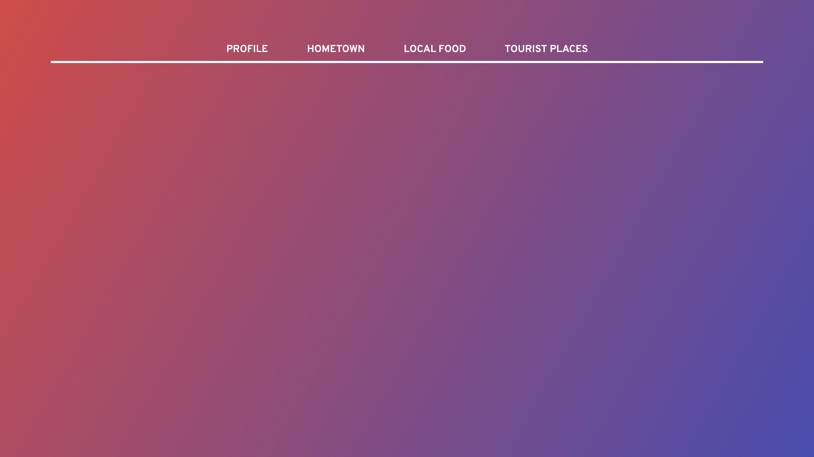
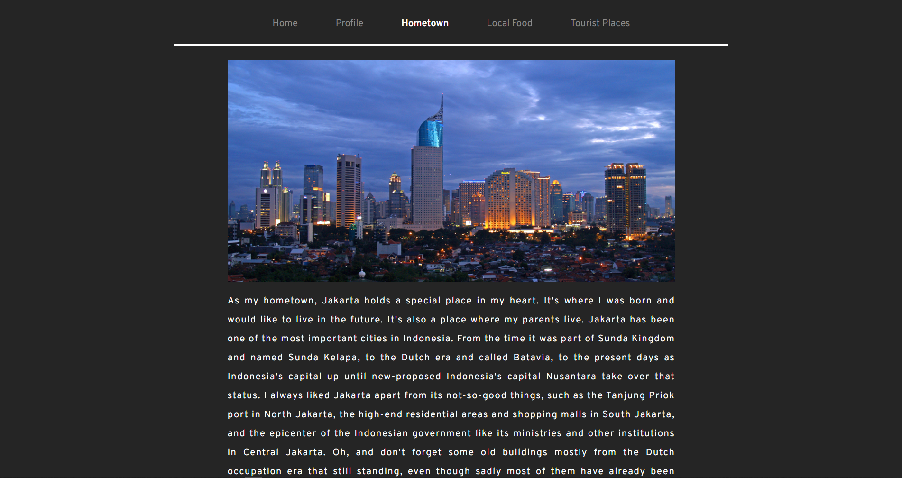
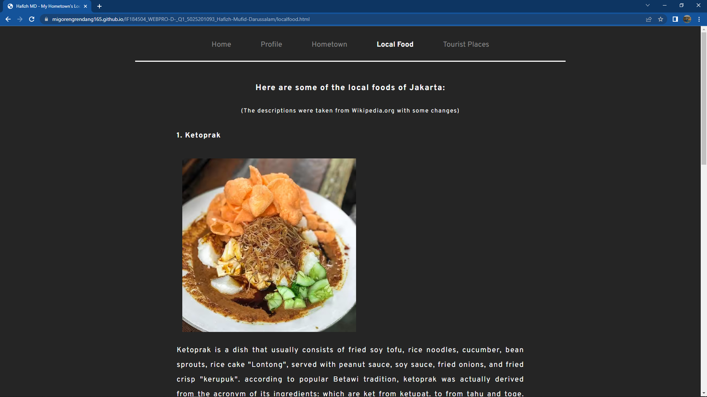
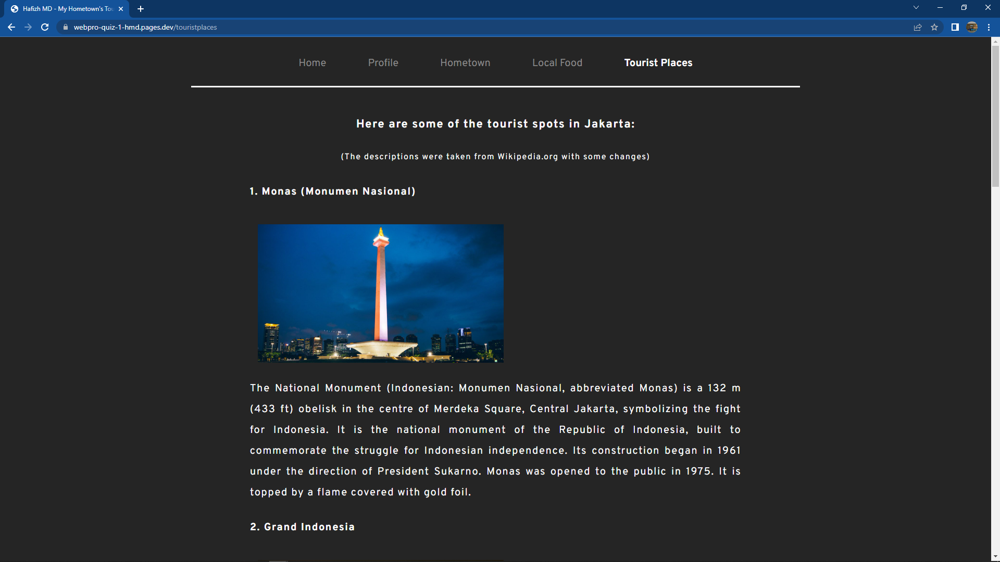

# IF184504_WEBPRO-D-_Q1_5025201093_Hafizh-Mufid-Darussalam
A Web Programming class assignment.
Link to the website: https://webpro-quiz-1-hmd.pages.dev/

# Design
The static website will use HTML and CSS. For this time, Javascript hasn't been used yet. Here is the image of what was the concept of the interface. 



It has gradient background that took inspiration from Ubuntu's wallpaper.


# Implementation
Here are some highlights of the implementation on building the web.
## HTML
For implementation, using Visual Studio Code for coding the web and web browser to preview the web. I use HTML and CSS for this website. The CSS has its own file named styles.css and can be called by HTML files through:
```
<link rel="stylesheet" href="styles.css">
```
Since the website will have multiple pages, we will call other HTML files through:
```
<a href="index.html" class="a_menudesktop">Home</a>
<a href="profile.html" class="a_menudesktop">Profile</a>
<a href="hometown.html" class="a_menudesktop" id="currentpage">Hometown</a>
<a href="localfood.html" class="a_menudesktop">Local Food</a>
<a href="touristplaces.html" class="a_menudesktop">Tourist Places</a>
```
On some pages, if I wanted to place some images, I could do it by using:
```

```
On some pages, if I wanted to write something, I could use ```<p>...</p>``` or ```<h4>...</h4>```.
## CSS
If I wanted to use a certain font, I could use:
```
@import url('https://fonts.googleapis.com/css2?family=Overpass:wght@400;500;600;700&display=swap');
```
The syntax above could be obtained from fonts.google.com. If I wanted to center an image, I could use:
```
#imagehometown {
    display: block;
    margin-left: auto;
    margin-right: auto;
    width:100%;
}
```

# Analysis/Evaluation
Here is the final result of the static website:



Notice that the background isn't a gradient but solid color. This is because after came up with gradient background, I noticed that the gradient wasn't smooth at all. There are "staircases effect" especially on color's transition. Unfortunately I don't have any documentation like screenshot of that gradient background. After that, I decided to use solid background. 

There is another problem when I was about to host the web. I tried Github, but it didn't work (sadly, no documentation) even though in the end it worked.



Then, I went to Cloudfare and it worked.



Now I have two identical website. Great success (?). Hypothesis: I need to wait for some time for Github to successfully host my website.
# Conclusion
In conclusion, when building a website, things will not always be going to run smoothly as we wished. There will be some challenges, problems, and obstacles in the execution. It's our job to overcome those obstacles.
